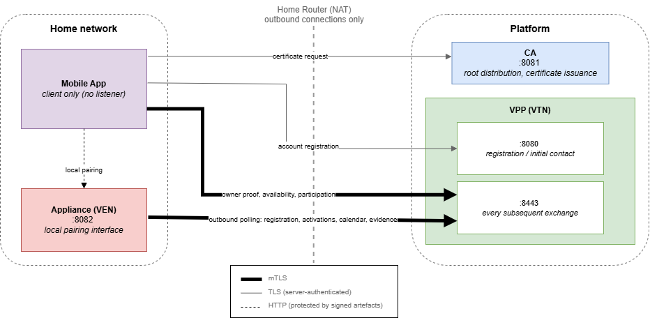

# Secure Demand Response Platform for Virtual Power Plants using Residential IoT Devices

A platform where households prove their electricity reductions **cryptographically**, so a grid operator can pay for a curtailment that actually happened, without ever monitoring what people do at home.

Bachelor's thesis, URV, 2026.

## The problem

Demand response (DR) works today with large industrial consumers: when the grid is strained, they cut consumption and get paid. Extending it to homes runs into two obstacles.

**Proof.** The operator has to know the reduction really happened. Continuous metering would prove it and would also reveal when you shower, cook or sleep.

**Trust.** The home is not a trusted environment and the coordinator is not trusted to respect what the user agreed to.

This platform answers both with cryptography instead of surveillance. The user declares *when* each appliance may be curtailed, the appliance itself enforces that declaration, and every completed curtailment produces a signed proof that is the only basis for payment.

## Project Components

| Component | Role | Stack |
|---|---|---|
| `android-app/` | User app: identity, pairing, availability, rewards | Kotlin, Jetpack Compose, Hilt |
| `vpp-server/` | Coordinator, acts as the OpenADR **VTN** | Python, FastAPI + a mutual-TLS listener |
| `appliance/` | The controllable load, acts as the OpenADR **VEN** | Python on a Raspberry Pi, software HSM |
| `manufacturer/` | Certificate authority and issuance service | Python, FastAPI |
| `backoffice/` | Synthetic fleet and DR-operator CLI | Python |



## Security Design

Everything rests on a single X.509 trust root.

**Identity is certified, not declared.** The appliance's nominal power lives in its certificate subject (`OU=P=2000`), set by the manufacturer. An appliance that over-declares its capacity is caught, because the value it signs must match the value the CA certified.

**Every channel that crosses the network is mutually authenticated.** The listener reads the client certificate off the TLS socket and maps its subject to an account and a role, so authentication and authorisation stay separate.

**Four artefacts are signed as JWS, independently of the channel that carries them**, because a channel proves who *delivered* a message, not who *produced* it:

| Artefact | Signed by | Purpose |
|---|---|---|
| Configuration bundle | User | Tells the appliance, authentically, who is enrolling it |
| Owner proof | Appliance HSM | Binds the device to its owner and its certified parameters |
| Availability calendar | User | Weekly schedule, with a monotonic version that blocks rollback |
| Participation evidence | Appliance HSM | The auditable record a reward is computed from |

The user's half of that never leaves the phone. The key is generated inside the Android Keystore and is non-exportable, so the app signs the CSR, the pairing bundle, the calendar and the mTLS handshake in place rather than holding key material it could leak.

**The appliance enforces its owner's calendar locally.** Not even the platform's own coordinator can activate it outside the declared slots, its maximum curtailment time, or its recovery period. Activations reach it by outbound polling only, so nothing ever connects *into* the home.

**Identity proof with the Spanish national eID.** The app reads the DNIe over NFC through a PACE secure channel, validates the card's chain up to the `AC RAIZ DNIE 2` root, and has the chip sign a freshly generated nonce with the user's PIN, so a copied public certificate cannot pass for a login.

## Verification

```
powershell -ExecutionPolicy Bypass -File .\run_all.ps1
```

The suite runs 14 gates and 138 checks. Every protocol step is exercised against its positive *and* its negative cases over the real stack, with real TLS and a real database: certificates outside the CA chain, invalid signatures, replayed activations, forged capacities, evidence submitted twice. The database is used as an attack vector too, planting a rolled-back calendar and one signed by a forged issuer directly into the row the appliance polls, to show the device refuses them on its own.

The Android client is covered too. `RegistrationFlowTest` drives the real protocol clients against the live local servers from the JVM, which is why those clients import nothing from Android.

**On real hardware.** `tests/verify_pi.py` runs a complete DR event against a Raspberry Pi across a real network boundary (11 checks). Registration, QR pairing and DNIe authentication were completed on a physical phone.

## What this prototype does not do

- **No revocation or renewal.** A compromised credential cannot be withdrawn, and the DNIe's revocation status is not checked.
- **Issuance-side validation is missing.** The CA verifies possession of the key but not the identity behind it, nor the operator role attribute. Both checks belong in the RA role and currently rest on the requesting side.
- **Trust on first use at pairing.** The prototype appliance ships without the CA root and adopts the one delivered in the first configuration bundle. In production it would be provisioned at the factory.
- **The HSM is emulated and the curtailment is simulated.** A signature proves the appliance produced the evidence, not that power flowed differently. Real metering behind the same signing boundary is the natural next step.
- **Selection is a deterministic greedy heuristic**, not an optimisation. Fairness across households is not considered.
- **Scale is untested.** One physical appliance, with fleet behaviour exercised through a synthetic population of 20 users and 40 appliances.

## Running it

```bash
cd certs && bash make_certs.sh && cd ..      # Git Bash + openssl
python -m venv .venv && .venv\Scripts\activate
pip install -r requirements.txt
powershell -ExecutionPolicy Bypass -File .\run_all.ps1
```

`start_services.ps1` leaves the services listening on the LAN instead, for the Android app and a deployed appliance. Two addresses are site-specific:

```bash
# this machine's LAN address, so a phone or a Raspberry Pi can reach the services
EXTRA_SAN_IPS="192.168.1.50" bash make_certs.sh

# the same address, for the app to hand to an appliance during pairing
echo "vpp.lan.host=192.168.1.50" >> android-app/local.properties

# a full DR event against a real Raspberry Pi
python tests/verify_pi.py http://raspberrypi.local:8082 192.168.1.50
```

> **No key material of any kind is in this repository.** `make_certs.sh` builds the entire PKI locally, and `*.key`, `*.pem`, `*.p12`, `*.crt` and friends are refused by `.gitignore` as patterns rather than paths, so a key written somewhere new is still caught. Two exceptions are explicit and public: the Spanish national police DNIe root, and the development CA root the Android app needs to compile. The `changeit` PKCS#12 password is a placeholder for locally generated test material and is overridable with `P12_PASS`.

## Building the Android app

The app has its own [README](android-app/README.md) covering its architecture, how the session is stored and how the DNIe login proves possession of the card.

The DNIe login needs the FNMT DNIeDroid SDK, which ships under its own terms, so it is not redistributed here. Request it from the FNMT and drop `dniedroid-release.aar` into `android-app/app/libs/`. Everything else builds once that file is present.

The rest of the system, including the whole verification suite, runs without the Android project.

## About

Built from the reference protocol of a research group at URV, developed together with the Graduate School of Engineering Science at Yokohama National University. My work was to take that design and turn it into a system that runs, and to verify that it does.

## License

MIT, see [LICENSE](LICENSE). It covers this implementation, not the FNMT SDK referenced above.
