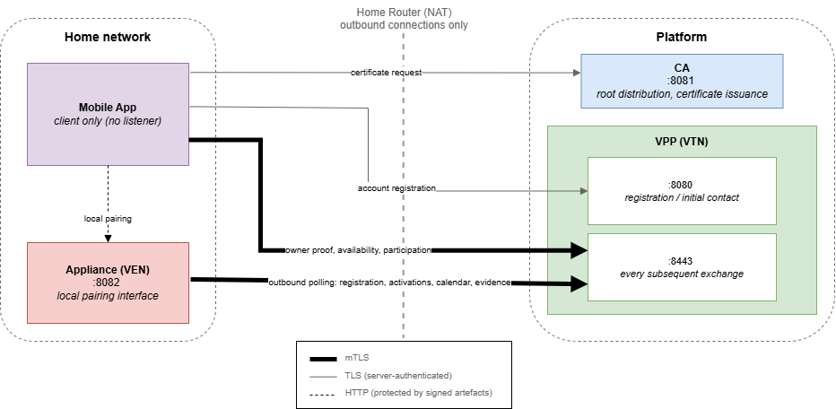

# Secure Demand Response Platform for Virtual Power Plants using Residential IoT Devices

A platform where households prove their electricity reductions **cryptographically**, so a grid operator can pay for a curtailment that actually happened, without ever monitoring what people do at home.

Bachelor's thesis, URV, 2026.

## The problem

Demand response (DR) works today with large industrial consumers: when the grid is strained, they cut consumption and get paid. Extending it to homes runs into two obstacles.

**Proof.** The operator has to know the reduction really happened. Continuous metering would prove it and would also reveal when you shower, cook or sleep.

**Trust.** The home is not a trusted environment and the coordinator is not trusted to respect what the user agreed to.

This platform answers both with cryptography instead of surveillance. The user declares *when* each appliance may be curtailed, the appliance itself enforces that declaration, and no reward exists without a signed proof the platform has verified.

## Project Components

| Component | Role | Stack |
|---|---|---|
| `android-app/` | User app: identity, pairing, availability, rewards | Kotlin, Jetpack Compose, Hilt |
| `vpp-server/` | Coordinator, acts as the OpenADR **VTN** | Python, FastAPI + a mutual-TLS listener |
| `appliance/` | The controllable load, acts as the OpenADR **VEN** | Python on a Raspberry Pi, software HSM |
| `ca/` | Certificate authority and issuance service | Python, FastAPI |
| `backoffice/` | Synthetic fleet and DR-operator CLI | Python |



## Security Design

Everything rests on a single X.509 trust root.

**Identity is certified, not declared.** The appliance's nominal power lives in its certificate subject (`OU=P=2000`). An appliance that inflates it at pairing is caught, because the value it signs must match the one in the certificate it presents. Binding the two is what the check buys. Whether the certificate carried the true figure in the first place is the issuance gap below.

**Every channel that crosses the network is mutually authenticated.** The listener reads the client certificate off the TLS socket and maps its subject to an account and a role, so authentication and authorisation stay separate.

**Every artefact that has to outlive the channel that carries it is signed as JWS**, because a channel proves who *delivered* a message, not who *produced* it:

| Artefact | Signed by | Purpose |
|---|---|---|
| Configuration bundle | User | Tells the appliance, authentically, who is enrolling it |
| Owner proof | Appliance HSM | Binds the device to its owner and its certified parameters |
| Availability calendar | User | Weekly schedule, with a monotonic version that blocks rollback |
| Participation evidence | Appliance HSM | The signed record a reward requires |
| Revocation list | CA | The withdrawn serials, numbered monotonically and valid 24 h, relayed to the appliance in every poll |
| Revocation and renewal requests | Operator, certificate holder | Carry their own certificate, because the CA's listener has no client certificates |

The user's half of that never leaves the phone. The key is generated inside the Android Keystore and is non-exportable, so the app signs the CSR, the pairing bundle, the calendar and the mTLS handshake in place rather than holding key material it could leak.

**The appliance enforces its owner's calendar locally.** Not even the platform's own coordinator can activate it outside the declared slots, its maximum curtailment time, or its recovery period. Activations reach it by outbound polling only, so nothing ever connects *into* the home. It trusts only the root installed at the factory next to its signing key, so a pairing bundle cannot bring its own.

**Credentials can be withdrawn and renewed.** An operator revokes a certificate by serial with a signed request, and the CA publishes its revocation list as a JWS under the root key, numbered monotonically and valid for 24 hours. The VPP checks the list on every mutual-TLS request and at enrolment, and relays it to the appliance, which verifies it against its factory root, refuses one with a lower number and stops acting when its copy expires. The CA issues one live certificate per subject, and the VPP does not let a different certificate take over an enrolled account while the old one stands. Renewal re-keys under the same subject and revokes the old certificate as superseded in the same act.

**Identity proof with the Spanish national eID.** The app reads the DNIe over NFC through a PACE secure channel, validates the card's chain up to the `AC RAIZ DNIE 2` root, and has the chip sign a freshly generated nonce with the user's PIN, so a copied public certificate cannot pass for a login.

## Verification

```
powershell -ExecutionPolicy Bypass -File .\run_all.ps1
```

The suite runs 16 gates and 181 checks. Every protocol step is exercised against its positive *and* its negative cases over the real stack, with real TLS and a real database: certificates outside the CA chain, invalid signatures, replayed activations, forged capacities, evidence submitted twice, revoked credentials at the mutual-TLS door, a rolled-back revocation list. The database is used as an attack vector too, planting a rolled-back calendar and one signed by a forged issuer directly into the row the appliance polls, to show the device refuses them on its own.

The Android client is covered too. `RegistrationFlowTest` drives the real protocol clients against the live local servers from the JVM, which is why those clients import nothing from Android.

**On real hardware.** `tests/verify_pi.py` runs a complete DR event against a Raspberry Pi across a real network boundary (11 checks). Registration, QR pairing and DNIe authentication were completed on a physical phone.

## What this prototype does not do

- **Revocation is a signed list, not OCSP.** The list is a JWS under the root key rather than an RFC 5280 CRL, the certificates carry no distribution point, and the VPP keeps its last copy past `next_update` when the CA is unreachable. The DNIe's own revocation status is not checked.
- **Issuance-side validation is missing.** The CA verifies possession of the key but not the identity behind it, nor the operator role attribute. Both checks belong in the RA role and currently rest on the requesting side.
- **The HSM is emulated and the curtailment is simulated.** A signature proves the appliance produced the evidence, not that power flowed differently. Real metering behind the same signing boundary is the natural next step.
- **Stored evidence is verified once, at submission.** No later path compares a participation row against the signature stored beside it, and the reward is computed from the row's own columns. A `reduction_pct` edited in the database would change a payout without invalidating anything. The availability path is the opposite: the appliance re-verifies the calendar on every poll, which is why a rolled-back row planted directly in the table is refused.
- **Selection is a deterministic greedy heuristic**, not an optimisation. Fairness across households is not considered.
- **Scale is untested.** One physical appliance, with fleet behaviour exercised through a synthetic population of 20 users and 40 appliances.

## Running it

```powershell
python -m venv .venv
.venv\Scripts\activate
pip install -r requirements.txt
python provision_all.py                      # root, then each component's own key and CSR
powershell -ExecutionPolicy Bypass -File .\run_all.ps1
```

That is the whole system verified against itself. Driving it by hand instead, with the phone, a Raspberry Pi and the synthetic fleet, is [RUNBOOK.md](RUNBOOK.md), and [TROUBLESHOOTING.md](TROUBLESHOOTING.md) covers what looks broken but is not.

> **No key material of any kind is in this repository.** `provision_all.py` builds the entire PKI locally, each component generating its own key pair and obtaining its certificate from a CSR, and `*.key`, `*.pem`, `*.p12`, `*.crt` and friends are refused by `.gitignore` as patterns rather than paths, so a key written somewhere new is still caught. Two exceptions are explicit and public: the Spanish national police DNIe root, and the development CA root the Android app needs to compile.

## Building the Android app

The app has its own [README](android-app/README.md) covering its architecture, how the session is stored and how the DNIe login proves possession of the card.

The DNIe login needs the FNMT DNIeDroid SDK, which ships under its own terms, so it is not redistributed here. Request it from the FNMT and drop `dniedroid-release.aar` into `android-app/app/libs/`. Everything else builds once that file is present.

The rest of the system, including the whole verification suite, runs without the Android project.

## About

Built from the reference protocol of a research group at URV, developed together with the Graduate School of Engineering Science at Yokohama National University. My work was to take that design and turn it into a system that runs, and to verify that it does.

## License

MIT, see [LICENSE](LICENSE). It covers this implementation, not the FNMT SDK referenced above.
